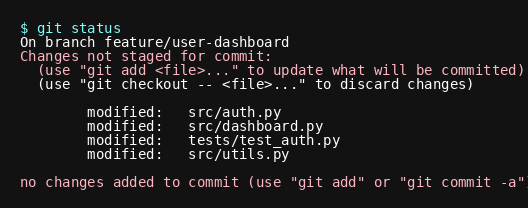
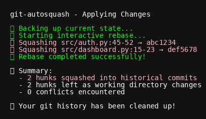

# git-autosquash

[](https://github.com/andrewleech/git-autosquash/actions/workflows/ci.yml)
[](https://github.com/andrewleech/git-autosquash/actions/workflows/docs.yml)
[](https://badge.fury.io/py/git-autosquash)
[](https://www.python.org/downloads/)

**Automatically squash changes back into historical commits where they belong.**

git-autosquash is a powerful tool that analyzes your working directory changes and automatically distributes them back to the commits where those code sections were last modified. Instead of creating noisy "fix lint errors", "cleanup tests", or "address review feedback" commits, it uses git blame analysis to intelligently squash improvements back into their logical historical commits.


**Perfect for common scenarios like**: You've been working on a feature branch and now need to fix lint errors, test failures, or code review feedback. Rather than committing all fixes into a final "cleanup" commit, git-autosquash lets you push each fix back to the original commit that introduced the issue, maintaining clean and logical git history.

## ✨ Key Features

- **🎯 Smart Targeting**: Uses git blame to find the exact commits where code was last modified
- **💻 Interactive TUI**: Rich terminal interface with syntax-highlighted diff viewer  
- **🛡️ Safety First**: Default unapproved state with user confirmation for all changes
- **🔧 Conflict Resolution**: Clear guidance when merge conflicts occur during rebase
- **📊 Progress Tracking**: Real-time feedback with detailed commit summaries
- **↩️ Rollback Support**: Full git reflog integration for easy recovery

### Feature Demonstrations

<details>
<summary>🎯 Smart Targeting with Git Blame Analysis</summary>


git-autosquash analyzes git blame to understand exactly which commits last modified each line of code, providing high-confidence targeting for your changes.
</details>

<details>
<summary>💻 Interactive Terminal Interface</summary>


Full keyboard navigation with syntax highlighting, real-time previews, and intuitive controls make reviewing changes efficient and clear.
</details>

<details>
<summary>🛡️ Safety-First Approach</summary>


All changes start unapproved by default. Full git reflog integration and backup creation ensure you can always recover if something goes wrong.
</details>

## 🚀 Quick Start

### Installation

```bash
# Recommended: Install with uv (fastest, modern Python package manager)
uv tool install git-autosquash

# Or with pipx for isolated environment
pipx install git-autosquash

# Or with pip
pip install git-autosquash
```

### Basic Usage

```bash
# Make some changes to your code
vim src/auth.py src/ui.py

# Run git-autosquash to organize changes
git-autosquash

# Review proposed changes in the TUI, approve what makes sense
# Changes are automatically squashed into their target commits!
```

## 📝 Workflow Example

Here's what a typical git-autosquash session looks like:

### Before: Messy History


### The git-autosquash Process

1. **Check Status** - See what changes need organizing


2. **Launch Analysis** - git-autosquash analyzes your changes


3. **Review Results** - See confidence levels and proposed targets


4. **Interactive Review** - Approve or modify the suggestions


5. **Execute Changes** - Watch the rebase happen safely


6. **Clean History** - Enjoy your organized git log


### After: Clean History


## 🔄 How It Works

1. **Analysis**: Parses your working directory changes into structured hunks
2. **Blame Investigation**: Uses `git blame` to find which commits last modified each line
3. **Target Resolution**: Applies frequency-based algorithm to select target commits with confidence scoring
4. **Interactive Review**: Presents findings in rich TUI with confidence indicators and diff previews
5. **Safe Execution**: Performs interactive rebase only on user-approved changes with full backup support

### Handling Edge Cases

git-autosquash gracefully handles complex scenarios:

<details>
<summary>🆕 New Files Without History</summary>


When files have no git blame history, git-autosquash offers intelligent fallback options based on recent commits and similar files.
</details>

<details>
<summary>❓ Ambiguous Blame Results</summary>


When multiple commits could be valid targets, you get clear options to choose the most appropriate one.
</details>

<details>
<summary>✏️ Manual Override Capability</summary>


Sometimes you know better than the algorithm - easily override suggestions when you have the full context.
</details>

## 🎯 Use Cases

### Perfect for:
- **Bug fixes during feature work** - Squash fixes back into original implementations
- **Code review feedback** - Distribute improvements to their logical commits
- **Refactoring sessions** - Integrate optimizations with original code
- **Documentation updates** - Keep docs synchronized with code changes
- **Lint and test fixes** - Clean up CI failures without polluting history
- **Security patches** - Apply security fixes to the vulnerable code commits

### Example: Code Review Workflow
```bash
# After addressing review feedback across multiple files
git-autosquash

# TUI automatically maps:
# - Security fix → Original security implementation commit
# - Performance improvement → Original algorithm commit  
# - Documentation update → Original feature commit
# - New functionality → Remains as new commits

# Result: Clean history where each commit tells complete story
```

## ⚙️ Command-Line Options

```bash
git-autosquash [OPTIONS]

Options:
  --line-by-line    Use line-by-line hunk splitting for maximum precision
  --version         Show version information
  --help           Show help message
```

### Precision Modes

- **Standard**: Uses git's default hunk boundaries (faster, good for most cases)
- **Line-by-line**: Analyzes each changed line individually (slower, maximum precision)

## 📚 Documentation

**Complete documentation is available at: https://andrewleech.github.io/git-autosquash/**

### Quick Links

- **[Getting Started](https://andrewleech.github.io/git-autosquash/user-guide/getting-started/)** - Your first git-autosquash session
- **[Basic Workflow](https://andrewleech.github.io/git-autosquash/user-guide/basic-workflow/)** - Common usage patterns
- **[CLI Reference](https://andrewleech.github.io/git-autosquash/reference/cli-options/)** - Command-line options and flags
- **[FAQ](https://andrewleech.github.io/git-autosquash/reference/faq/)** - Frequently asked questions
- **[API Reference](https://andrewleech.github.io/git-autosquash/technical/api-reference/)** - Developer documentation

### Documentation Sections

- **User Guides**: Installation, getting started, advanced usage, troubleshooting
- **Examples**: Real-world scenarios, complex workflows, IDE integration  
- **Technical**: Architecture, development guide, testing strategy
- **Reference**: CLI options, configuration, FAQ, API documentation

## 🔧 Advanced Features

### Conflict Resolution


When conflicts occur during rebase, git-autosquash provides clear guidance and options for resolution.

### Progress Tracking


Real-time feedback keeps you informed during the rebase process with detailed progress indicators.

## 🚀 Development Status

git-autosquash is actively developed and functional. All core features are implemented and tested:

- ✅ Git repository analysis and validation
- ✅ Diff parsing with both standard and line-by-line modes  
- ✅ Git blame analysis with intelligent target resolution
- ✅ Rich terminal interface with Textual framework
- ✅ Interactive rebase execution with conflict handling
- ✅ Comprehensive error handling and recovery
- ✅ Full test suite with 400+ passing tests
- ✅ Screenshot capture system for documentation

## 🤝 Contributing

We welcome contributions! Please see our [Development Guide](https://andrewleech.github.io/git-autosquash/technical/development/) for details on:

- Setting up the development environment
- Code standards and pre-commit hooks  
- Testing strategy and guidelines
- Submitting pull requests

### Quick Development Setup

```bash
git clone https://github.com/andrewleech/git-autosquash.git
cd git-autosquash

# Install in development mode
uv pip install -e ".[dev]"

# Install pre-commit hooks (required)
uv run pre-commit install

# Run tests
uv run pytest

# Generate screenshots for documentation
uv run python capture_readme_screenshots.py
```

### Screenshot System

git-autosquash includes a comprehensive screenshot capture system using `pyte` terminal emulation:

```bash
# Test screenshot generation
uv run pytest tests/test_tui_screenshot_integration.py -v

# Generate all README screenshots
uv run python capture_readme_screenshots.py

# Screenshots saved to screenshots/readme/
```

See `TUI_SCREENSHOT_GUIDE.md` for complete documentation of the screenshot system.

## 📄 License

[License information to be added]

## 🙏 Acknowledgments

- Built with [Textual](https://textual.textualize.io/) for the rich terminal interface
- Powered by [uv](https://github.com/astral-sh/uv) for fast dependency management  
- Documentation built with [MkDocs Material](https://squidfunk.github.io/mkdocs-material/)
- Screenshot system uses [pyte](https://github.com/selectel/pyte) for terminal emulation

## 📞 Support

- **Documentation**: https://andrewleech.github.io/git-autosquash/
- **Issues**: [GitHub Issues](https://github.com/andrewleech/git-autosquash/issues)
- **Discussions**: [GitHub Discussions](https://github.com/andrewleech/git-autosquash/discussions)

---

*Transform your cluttered git history into clean, logical commits with git-autosquash!*