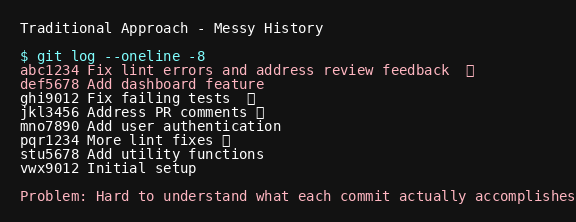
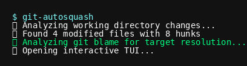
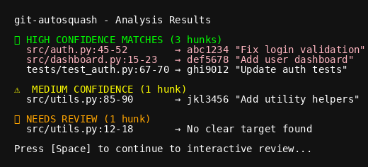

# git-autosquash

[](https://github.com/andrewleech/git-autosquash/actions/workflows/ci.yml)
[](https://badge.fury.io/py/git-autosquash)
[](https://www.python.org/downloads/)

**Automatically squash changes back into historical commits where they belong.**

git-autosquash is a powerful tool that analyzes your working directory changes and automatically distributes them back to the commits where those code sections were last modified. Instead of creating noisy "fix lint errors", "cleanup tests", or "address review feedback" commits, it uses git blame analysis to intelligently squash improvements back into their logical historical commits.


**Common scenario**: You've been working on a feature branch and now need to fix lint errors, test failures, or code review feedback. Rather than committing all fixes into a final "cleanup" commit, git-autosquash lets you push each fix back to the original commit that introduced the issue, maintaining clean and logical git history.

!!! info "Project Status"
    git-autosquash is actively developed and functional. All core features are implemented: git analysis, blame-based targeting, interactive TUI, and rebase execution. The tool is ready for daily use with comprehensive testing and error handling.

## ✨ Key Features

- **🎯 Smart Targeting**: Uses git blame to find the exact commits where code was last modified
- **🖥️ Interactive TUI**: Rich terminal interface with syntax-highlighted diff viewer  
- **🔒 Safety First**: Default unapproved state with user confirmation for all changes
- **⚡ Conflict Resolution**: Clear guidance when merge conflicts occur during rebase
- **📊 Progress Tracking**: Real-time feedback with detailed commit summaries
- **🔄 Rollback Support**: Automatic cleanup and restoration on errors or interruption

### Feature Demonstrations

??? example "🎯 Smart Targeting with Git Blame Analysis"
    
    
    git-autosquash analyzes git blame to understand exactly which commits last modified each line of code, providing high-confidence targeting for your changes.

??? example "🖥️ Interactive Terminal Interface"
    
    
    Full keyboard navigation with syntax highlighting, real-time previews, and intuitive controls make reviewing changes efficient and clear.

??? example "🔒 Safety-First Approach"
    
    
    All changes start unapproved by default. Full git reflog integration and backup creation ensure you can always recover if something goes wrong.

## 🚀 Quick Start

### Installation

=== "uv (Recommended)"

    ```bash
    uv tool install git-autosquash
    ```

=== "pipx"

    ```bash
    pipx install git-autosquash
    ```

=== "pip"

    ```bash
    pip install git-autosquash
    ```

### Basic Usage

1. Make changes to your codebase
2. Run git-autosquash to analyze and distribute changes:

```bash
git-autosquash
```

3. Review the proposed hunk → commit mappings in the interactive TUI
4. Approve changes you want to squash back into their target commits
5. Let git-autosquash perform the interactive rebase automatically

## 🎬 How It Works


## 📋 Example Workflow

Here's what a typical git-autosquash session looks like:

### Before: Messy History


### The git-autosquash Process

The workflow transforms cluttered history into clean, logical commits through these steps:

!!! example "Step 1: Check Status"
    
    
    See what changes need organizing

!!! example "Step 2: Launch Analysis"
    
    
    git-autosquash analyzes your changes

!!! example "Step 3: Review Results"
    
    
    See confidence levels and proposed targets

!!! example "Step 4: Interactive Review"
    
    
    Approve or modify the suggestions

### After: Clean History


The TUI shows you exactly which changes can go back to which commits, with confidence levels and clear diff visualization.

## 🎯 Use Cases

- **Bug fixes**: Automatically squash fixes back to the commits that introduced bugs
- **Refactoring**: Distribute code improvements back to their logical commits  
- **Code cleanup**: Move formatting and style changes to appropriate historical points
- **Feature development**: Separate bug fixes from new features during development
- **Commit message fixes**: Clean up commit history by moving changes to better locations
- **Selective uncommit**: Extract accidentally committed code back to working tree while preserving clean history

## 🛡️ Safety Features

git-autosquash is designed with safety as the top priority:

- **Default rejection**: All changes start as unapproved, requiring explicit user consent
- **Conflict detection**: Clear guidance when rebase conflicts occur
- **Automatic rollback**: Repository restored to original state on errors or interruption  
- **Branch validation**: Only works on feature branches with clear merge-base
- **Stash management**: Safely handles mixed staged/unstaged states
- **Comprehensive testing**: 121+ tests covering all edge cases and failure modes

## 📚 Next Steps

- [Installation Guide](installation.md) - Detailed setup instructions
- [Getting Started](user-guide/getting-started.md) - Your first git-autosquash workflow
- [Basic Workflow](user-guide/basic-workflow.md) - Common usage patterns
- [Advanced Usage](user-guide/advanced-usage.md) - Power user features
- [Examples](examples/basic-scenarios.md) - Real-world scenarios and solutions

## 🤝 Contributing

git-autosquash is open source and welcomes contributions! Check out our:

- [Development Guide](technical/development.md) - Set up development environment
- [Architecture Overview](technical/architecture.md) - Understand the codebase
- [Testing Guide](technical/testing.md) - Run and write tests

## 📄 License

MIT License - see [LICENSE](https://github.com/andrewleech/git-autosquash/blob/main/LICENSE) for details.