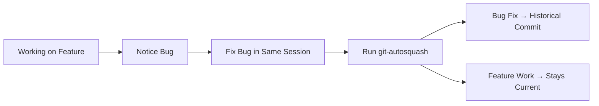

# Basic Workflow

This guide covers the most common git-autosquash usage patterns and workflows that you'll encounter in day-to-day development.

## Standard Development Workflow

### 1. Feature Development with Bug Fixes

This is the most common scenario: you're working on a feature branch and discover bugs in existing code that should be fixed in their original commits.

**Scenario**: You're adding user authentication and notice a validation bug in existing login code.

```bash
# You're on a feature branch
git checkout -b feature/oauth-integration

# Make changes to multiple files
vim src/auth/oauth.py      # New OAuth implementation
vim src/auth/login.py      # Fix validation bug in existing code  
vim src/ui/login_form.py   # Update form for OAuth

# Check what you've changed
git status
# modified:   src/auth/oauth.py
# modified:   src/auth/login.py  
# modified:   src/ui/login_form.py

# Run git-autosquash
git-autosquash
```

**Expected Results**:
- OAuth implementation changes → Stay in current working directory (no target found)
- Login validation fix → Goes back to commit that introduced the login functionality
- Form updates → Mixed (some to original form commit, some stay as new feature)

### 2. Code Cleanup and Refactoring

**Scenario**: You've been refactoring code and want to distribute improvements back to their logical commits.

```bash
# After refactoring session
git status
# modified:   src/database/models.py     # Performance improvements
# modified:   src/api/handlers.py        # Error handling improvements
# modified:   src/utils/validation.py    # Code style cleanup

git-autosquash
```

The TUI will show you which improvements can go back to the commits that originally introduced each piece of functionality.

### 3. Mixed Staged and Unstaged Changes

git-autosquash intelligently handles different working tree states:

```bash
# Some changes staged, others not
git add src/auth/login.py
git status
# Changes to be committed:
#   modified:   src/auth/login.py
# Changes not staged for commit:
#   modified:   src/ui/dashboard.py
#   modified:   src/utils/helpers.py

git-autosquash
# Mixed staged and unstaged changes detected.
# Choose an option:
#   a) Process all changes (staged + unstaged)  
#   s) Stash unstaged changes and process only staged
#   q) Quit
```

!!! tip "Recommended Approach"
    - **Option a**: Most common choice, processes all changes together
    - **Option s**: Use when you want to be very careful about what gets rebased
    - **Option q**: Use to manually stage exactly what you want first

## TUI Navigation Patterns

### Efficient Review Workflow

1. **Quick scan**: Use ↑/↓ to quickly review all mappings first
2. **Detailed review**: For each mapping:
   - Check the target commit message and date
   - Review the diff in the right panel
   - Consider the confidence level
3. **Batch approval**: Use `a` to toggle all if most look good, then manually adjust
4. **Execute**: Press Enter when satisfied

### Confidence Level Strategy

**High Confidence** (Green):
- Usually safe to approve automatically
- All lines blame to the target commit
- Clear logical connection

**Medium Confidence** (Yellow):  
- Review the diff carefully
- Most lines match but some uncertainty
- Consider the logical relationship

**Low Confidence** (Red):
- Be very cautious
- Mixed blame results or newer commits involved
- Often better to leave as new changes

### Keyboard Shortcuts Reference

| Action | Key | Description |
|--------|-----|-------------|
| Navigate | ↑↓ or jk | Move between hunk mappings |
| Toggle approval | Space | Approve/reject current mapping |
| Toggle all | a | Approve or reject all mappings |
| Execute | Enter | Start rebase with approved changes |
| Cancel | Escape or q | Abort operation |
| Help | ? | Show help (if implemented) |

## Common Scenarios

### Scenario: Bug Fix During Feature Work



**Best Practice**: Fix bugs as you encounter them, then use git-autosquash to organize the changes appropriately.

### Scenario: Code Review Feedback

You receive code review feedback asking for changes across multiple commits:

```bash
# After addressing review feedback
git status
# modified:   src/auth/login.py      # Requested security fix
# modified:   src/ui/dashboard.py    # Requested UI improvement  
# modified:   docs/api.md           # Documentation update

git-autosquash
# Security fix → Goes to original login commit
# UI improvement → Goes to original dashboard commit  
# Documentation → Stays as new change (no logical target)
```

### Scenario: Merge Conflict Resolution

Sometimes you'll encounter conflicts during the rebase:

```bash
git-autosquash
# ... TUI workflow ...
# ✓ Squash operation completed successfully!

# Later, if conflicts occurred:
# ⚠️ Rebase conflicts detected:
#   src/auth/login.py
# 
# To resolve conflicts:
# 1. Edit the conflicted files to resolve conflicts
# 2. Stage the resolved files: git add <files>  
# 3. Continue the rebase: git rebase --continue
# 4. Or abort the rebase: git rebase --abort
```

**Resolution Process**:
1. Open conflicted files in your editor
2. Resolve conflicts (remove `<<<<<<<`, `=======`, `>>>>>>>` markers)
3. Stage resolved files: `git add src/auth/login.py`
4. Continue: `git rebase --continue`

## Branch Management

### Safe Branch Practices

**✅ Good practices**:
- Use git-autosquash on feature branches only
- Ensure your branch has a clear merge-base with main/master
- Keep feature branches focused and reasonably sized

**❌ Avoid**:
- Running on main/master branch directly
- Using on branches without clear merge-base
- Running on very large branches with complex history

### Working with Shared Branches

!!! warning "Shared Branch Caution"
    If others are working on your branch:
    
    1. **Coordinate first**: Let team members know you're rebasing
    2. **Force push required**: After git-autosquash, you'll need `git push --force-with-lease`
    3. **Team updates**: Others will need to `git pull --rebase` or reset their local branches

### Branch Cleanup After Success

```bash
# After successful git-autosquash
git log --oneline -10  # Verify the results look good

# If satisfied, you might want to:
git push --force-with-lease origin feature/oauth-integration

# Or continue with more development
git commit -m "Add OAuth provider configuration"
```

## Performance Tips

### Large Repositories

For large repositories with extensive history:

- git-autosquash caches blame and commit information
- First run may be slower as caches are built  
- Subsequent runs on the same branch are much faster
- Consider using `--line-by-line` for very precise control

### Optimizing for Speed

```bash
# For large changesets, line-by-line can be more precise
git-autosquash --line-by-line

# Standard mode is faster for most cases
git-autosquash
```

## Integration with Git Workflows

### Pre-Push Hook

You can integrate git-autosquash into your workflow with git hooks:

```bash
#!/bin/bash
# .git/hooks/pre-push

echo "Checking if working directory needs git-autosquash..."
if ! git diff --quiet; then
    echo "Uncommitted changes found. Consider running git-autosquash first."
    read -p "Continue with push? (y/n): " -n 1 -r
    echo
    if [[ ! $REPLY =~ ^[Yy]$ ]]; then
        exit 1
    fi
fi
```

### IDE Integration

Many IDEs can be configured to run git-autosquash:

- **VS Code**: Add as a task or terminal command
- **IntelliJ/PyCharm**: Configure as external tool
- **Vim/Neovim**: Create command mapping

## Troubleshooting Common Issues

### "No target commits found"

This happens when:
- All changes are in new files
- Changes are outside the branch scope (before merge-base)
- Git blame doesn't find clear ownership

**Solution**: Review if the changes actually belong in historical commits, or if they should stay as new changes.

### "Command not found"

**Check installation**:
```bash
which git-autosquash
git-autosquash --version
```

**Reinstall if needed**:
```bash
pipx reinstall git-autosquash
```

### "Not in a git repository"

Ensure you're in a Git repository:
```bash
pwd
git status
```

### Performance issues

For very large diffs:
- Consider breaking changes into smaller chunks
- Use `--line-by-line` for more granular control  
- Ensure you have adequate memory and disk space

## Next Steps

- Learn about [Advanced Usage](advanced-usage.md) options and power features
- Explore [Complex Workflows](../examples/complex-workflows.md) for challenging scenarios  
- Check [Troubleshooting](troubleshooting.md) for detailed problem-solving guides