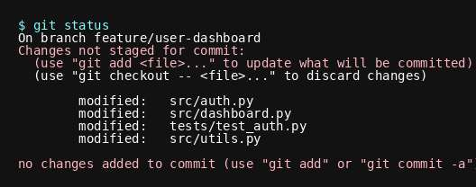
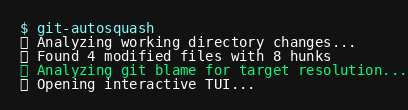
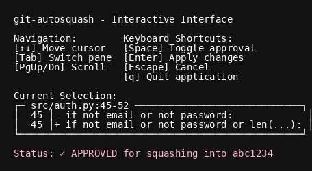
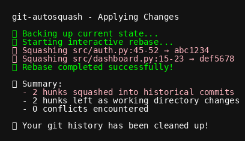

# Getting Started

This guide will walk you through your first experience with git-autosquash, from setup to successfully distributing changes back to historical commits.

!!! note "Current Implementation Status"
    git-autosquash is actively being developed. All core functionality is implemented and working: diff analysis, git blame integration, TUI interface, and interactive rebase execution. Some advanced features and edge case handling are still being refined.

## Prerequisites

Before starting, make sure you have:

- [Installed git-autosquash](../installation.md)
- A Git repository with some commit history
- Working directory changes or staged changes to distribute

## Your First git-autosquash Session

### Step 1: Set Up a Test Scenario

Let's create a realistic scenario. We'll assume you've been working on a feature and made several changes:



### Step 2: Run git-autosquash

Simply run the command:

```bash
git-autosquash
```

You'll see initial analysis output:



!!! info "What's Happening?"
    - git-autosquash analyzes your branch and finds the merge base with main/master
    - It parses your changes into individual "hunks" (code sections)
    - For each hunk, it runs git blame to find which commit last modified those lines
    - It launches an interactive TUI to show you the proposed mappings

### Step 3: Navigate the TUI Interface

The TUI opens with three main sections:



### Step 4: Review and Approve Changes

For each hunk mapping:

1. **Review the target commit**: Check if the mapping makes sense
2. **Examine the diff**: The right panel shows exactly what will be changed
3. **Check confidence level**: 
   - **High**: Strong evidence this change belongs in the target commit
   - **Medium**: Likely correct but review carefully
   - **Low**: Uncertain mapping, consider carefully

4. **Approve or reject**: Check the box to approve squashing this hunk

#### Keyboard Navigation

- **↑/↓ or j/k**: Navigate between hunk mappings
- **Space**: Toggle approval checkbox for selected hunk
- **Enter**: Approve all hunks and continue
- **a**: Toggle all hunks at once
- **Escape**: Cancel the operation

### Step 5: Execute the Squash

After approving the changes you want, press **Enter** to execute:



### Step 6: Verify the Results

Check your git history to see the changes:

```bash
# View the updated commits
git log --oneline -10

# Check specific commit changes
git show abc1234
git show def5678
```

You'll see that your changes have been incorporated into the appropriate historical commits!

## Understanding the Process

### What git-autosquash Does

1. **Analysis Phase**:
   - Parses your working directory changes into hunks
   - Runs git blame on each changed line range
   - Identifies the commit that last modified those lines
   - Filters commits to only include those on your current branch

2. **Approval Phase**:
   - Shows you proposed hunk → commit mappings
   - Lets you review diffs and approve/reject each mapping
   - Provides confidence levels based on blame analysis

3. **Execution Phase**:
   - Groups approved hunks by target commit
   - Executes interactive rebase to edit historical commits
   - Applies patches to amend the appropriate commits
   - Handles conflicts and provides guidance for resolution

### Confidence Levels Explained

- **High Confidence**: All lines in the hunk were last modified by the target commit
- **Medium Confidence**: Most lines match the target commit, some uncertainty
- **Low Confidence**: Mixed blame results or newer commits involved

!!! tip "Start Conservative"
    On your first few uses, only approve "high confidence" mappings until you're comfortable with the process.

## Common First-Time Questions

### "What if I make a mistake?"

git-autosquash includes several safety features:
- All changes start as unapproved (you must explicitly approve them)
- You can cancel at any time with Escape
- If something goes wrong, git-autosquash attempts automatic rollback
- You can always use `git rebase --abort` to manually undo an in-progress rebase

### "What if there are conflicts?"

When conflicts occur, git-autosquash:
1. Pauses the rebase at the conflicted commit
2. Shows you exactly which files have conflicts
3. Provides clear instructions for resolution:
   ```
   ⚠️ Rebase conflicts detected:
     src/auth/login.py
   
   To resolve conflicts:
   1. Edit the conflicted files to resolve conflicts
   2. Stage the resolved files: git add <files>
   3. Continue the rebase: git rebase --continue
   4. Or abort the rebase: git rebase --abort
   ```

### "Can I undo the changes?"

If you need to undo a completed git-autosquash operation:

1. **If you haven't pushed yet**: Use `git reflog` to find the commit before git-autosquash ran, then `git reset --hard <commit>`

2. **If you have pushed**: You'll need to force push (be careful on shared branches) or create new commits that revert the changes

### "What files should I avoid squashing?"

Be cautious with:
- Files that have been heavily modified by multiple commits
- Configuration files that change frequently  
- Files where the blame information might not represent logical ownership
- Large refactoring changes that span multiple commits

## Next Steps

Now that you've completed your first git-autosquash session:

- Learn about [Basic Workflow](basic-workflow.md) patterns
- Explore [Advanced Usage](advanced-usage.md) options like `--line-by-line`
- Check out [Example Scenarios](../examples/basic-scenarios.md) for common use cases
- Review [Troubleshooting](troubleshooting.md) for tips on handling edge cases

## Quick Reference

| Action | Keyboard Shortcut |
|--------|------------------|
| Navigate up/down | ↑/↓ or k/j |
| Toggle approval | Space |
| Approve all and continue | Enter |
| Toggle all hunks | a |
| Cancel operation | Escape |
| Quit application | q or Ctrl+C |